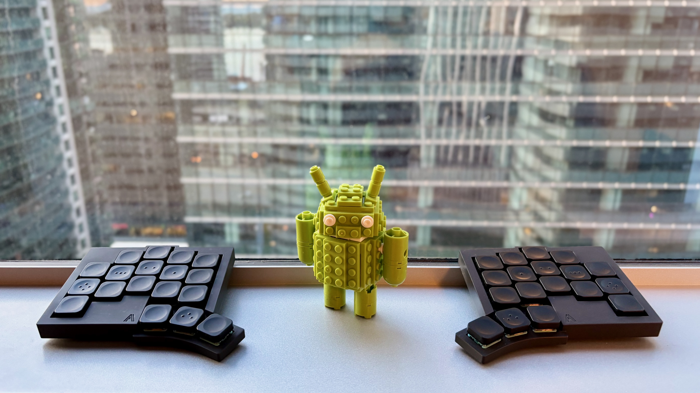
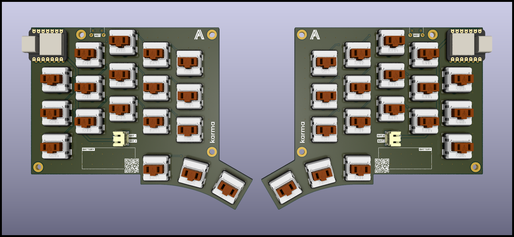
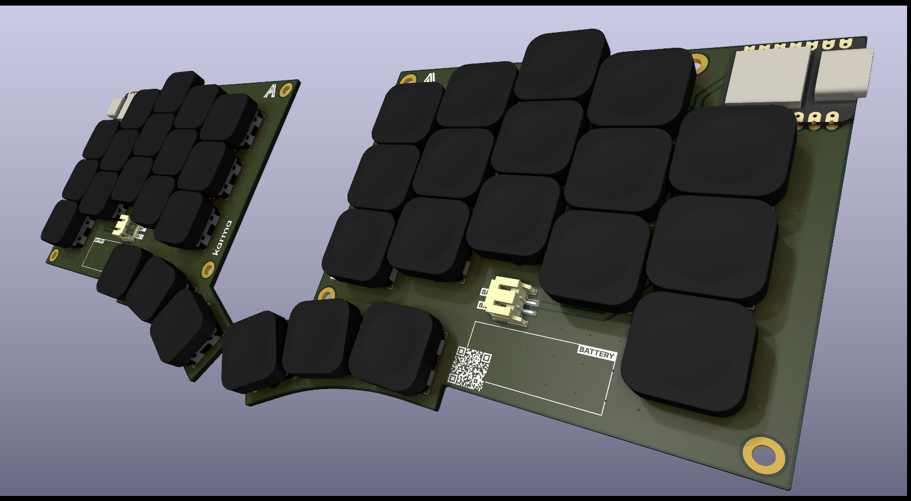

# Karma

Karma is a 36-key wireless split ergonomic mechanical keyboard inspired by two very popular ergonomic keyboards: [Corne](https://github.com/foostan/crkbd) and [TOTEM](https://github.com/GEIGEIGEIST/TOTEM).

## Features

- **Ergonomic 36-key layout**: A compact layout with 3x5 column-staggered keys, plus 3 thumb keys for each side.
- **Wireless first**: Prioritizes a wireless split setup but can be used partially-wired by connecting the central side using USB-C.
- **Low-profile design**: Engineered for a sleek, low-profile build that allows your palms to rest comfortably on the table while typing. This is achieved through the use of Kailh Choc switches and recessed cutouts for hot-swap sockets, reducing the overall case height (similar to the TOTEM keyboard), and using 1mm EVA foam instead of rubber feet.
- **Exceptional battery life**: Has a battery life that is measured in weeks, not days.

### Firmware

The Karma keyboard supports the [ZMK](https://zmk.dev/) open-source firmware. You can find my ZMK configuration for this keyboard in [this repo](https://github.com/achyudh/karma-zmk).

## Build Guide

### Bill of Materials

To build the Karma keyboard, you'll need the following components:

| Part Name                               | Qty    | Remarks   |
| --------------------------------------- |:------:| --------- |
| 2x SEEED XIAO BLE microcontrollers      | 2      |           |
| Kailh Choc V1 low-profile switches      | 36     | Low-profile mechanical switches |
| Keycaps compatible with Kailh Choc V1   | 36     | MX-spaced keycaps are preferred for better fit |
| Hotswap sockets for Kailh Choc V1       | 36     |           |
| SOD123 diodes                           | 36     |           |
| JST PH 2-pin SMD Header                 | 2      |           |
| 301230 LiPo Batteries                   | 2      | Only 1 required for partially wired build |
| 3D-printed case                         | 2      |           |
| M2 screws (5mm length)                  | 8      |           |
| M2 heat-set inserts (2mm height)        | 8      |           |
| Self-adhesive EVA foam (1mm)            | -      | A slimmer alternative to rubber feet |

### Assembly

**1. Order the Components**
- Zip up the gerber files for the [left side](./pcb-left/pcb-left-gerbers/) and the [right side](./pcb-right/pcb-right-gerbers/).
- Order the PCBs from a PCB prototype manufacturer like JLCPCB.
- 3D print the STL files for the case in [this repo](./enclosure/).
- All the other components are generic and can be found in Aliexpress.

**2. Solder the Diodes**
- Solder the SOD123 diodes to the top of the PCB, paying attention to the polarity.
- Apply solder to one pad, place the diode, and reflow the solder. Then solder the second pad.

**3. Install the Hotswap Sockets**
- Solder hotswap sockets in place by first securing one pad, then ensuring they are properly seated before soldering the second pad.

**4. Microcontroller Installation**
- Flash the firmware onto the SEEED XIAO BLE microcontrollers before soldering them to the PCB.
- Place the microcontroller in the designated spot and solder the pads, starting with the corners to secure it, then solder the rest.

**5. Connect the Batteries**
- Solder the JST PH 2-pin SMD Header to the PCB.
- Check the polarity of the battery with a multimeter and connect the batteries to the JST header such that the red wire is connected to the positive (+) pad and the black wire to the negative (-) pad on the PCB.

**6. Mount the Case**
- Insert M2 heat-set inserts into the screw holes in the 3D-printed case.
- Place the PCB inside the case, ensuring the microcontroller and battery fit snugly.
- Attach the two halves of the case using the M2 screws, securing them tightly.

**7. Install the Keycaps and Switches**
- Insert the Kailh Choc V1 switches into the hotswap sockets, ensuring they click into place.
- Attach your keycaps to the switches.

**8. Add EVA Foam**
- Cut and apply self-adhesive EVA foam to the bottom of the case for added grip and cushioning.

**9. Final steps**
- Once assembled, test the keyboard to ensure all switches and connections work.
- If necessary, adjust the [ZMK](https://zmk.dev/) firmware for your specific keymap.

Congratulations! You've completed your Karma keyboard build.

## License

This project is open-source and licensed under the CERN Open Hardware Licence Version 2 - Strongly Reciprocal License. See the [LICENSE](./LICENSE) file for details.